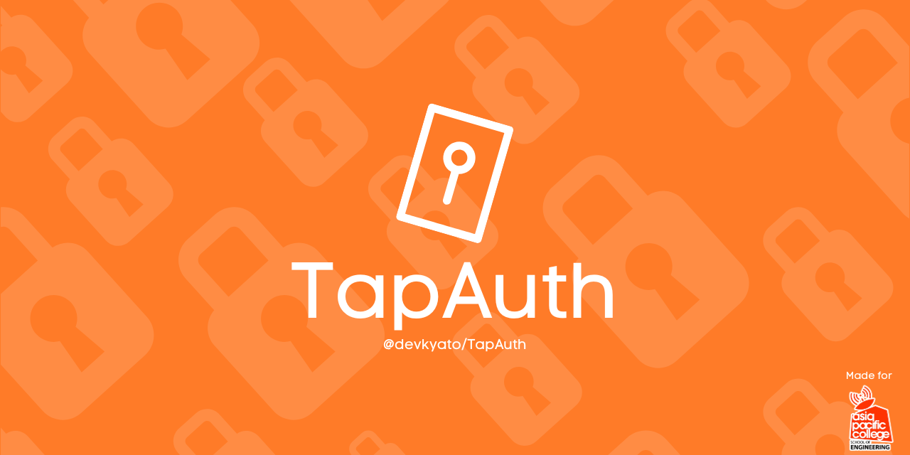

# TapAuth — NFC access and reservations



[](https://github.com/devkyato/TapAuth/actions/workflows/ci.yml)
[](https://github.com/devkyato/TapAuth/releases/latest)
[](LICENSE)
[](scripts/setup_raspberry_pi.sh)

TapAuth is an open-source, Raspberry Pi-ready NFC attendance and reservation kiosk. It pairs an ACR122U reader with a lightweight Flask app, keeps working from local MySQL when the internet is unavailable, and mirrors students and attendance logs to Firebase Realtime Database.

Built for the Asia Pacific College School of Engineering AIRHub by [@devkyato](https://github.com/devkyato).

## Try the interface locally

The repository includes a dependency-free preview that uses browser storage and simulated NFC taps:

```bash
python -m http.server 4173
```

Open `http://127.0.0.1:4173`. The Flask, MySQL, NFC, and Firebase services are used only by the Raspberry Pi runtime.

## Highlights

- NFC tap-in and tap-out with automatic state detection
- Fast registration directly after an unknown card is tapped—no shared student code
- 3D printing and teacher appointment request flows with Pi-local model storage
- Durable on-device NFC registry with MySQL reconciliation and a Firebase retry queue
- Private student directory and code-protected management dashboard
- Firebase Realtime Database live copy and public-safe attendance feed
- Automatic Raspberry Pi startup, kiosk mode, reader reconnection, and GitHub updates
- Plain HTML, CSS, JavaScript, and Python; no frontend build step

## How it works

```text
ACR122U card tap
      │
      ▼
Raspberry Pi + Flask ───► On-device NFC registry
      │                         │
      ├────────────────────► Local MySQL
      │                         └── offline-safe retry queue
      ▼
Firebase Realtime Database ───► hosted/public activity view
```

Unknown cards receive a short-lived registration session tied to that exact physical tap. Registered cards can check in/out or open the appointment flow. Student NFC identifiers never appear in public Firebase records or the admin API.

## Quick start on Raspberry Pi

Requirements: Raspberry Pi OS, an ACR122U USB NFC reader, internet for first-time setup, and a Firebase Realtime Database if cloud sync is wanted.

```bash
git clone https://github.com/devkyato/TapAuth.git
cd TapAuth
cp .env.example .env
nano .env
bash scripts/setup_raspberry_pi.sh
```

The setup script installs MariaDB, Python dependencies, libnfc, udev permissions, the `airhub.service` systemd unit, boot-time Git updates, and Chromium kiosk startup.

Open:

- Kiosk: `http://127.0.0.1:5000/`
- Student management: `http://127.0.0.1:5000/admin`
- Health and reader status: `http://127.0.0.1:5000/system_status`

## Environment

Start from [.env.example](.env.example). At minimum, set a strong MySQL password and admin code:

```env
AIRHUB_DB_USER=airhub_app
AIRHUB_DB_PASSWORD=replace-with-a-strong-password
AIRHUB_DB_NAME=airhub_db
TAPAUTH_ADMIN_CODE=replace-with-a-private-admin-code
TAPAUTH_REGISTRY_PATH=
```

To enable Firebase copying:

```env
AIRHUB_FIREBASE_ENABLED=true
AIRHUB_FIREBASE_MODE=realtime_db
AIRHUB_FIREBASE_DATABASE_URL=https://your-project-default-rtdb.region.firebasedatabase.app
AIRHUB_FIREBASE_DATABASE_SECRET=your-server-side-database-secret
AIRHUB_FIREBASE_PROJECT_ID=your-project-id
AIRHUB_FIREBASE_ROOT=tapauth
```

The Firebase browser `apiKey` is a public project identifier, not an admin credential. Keep the Realtime Database secret, service-account files, `.env`, and MySQL password out of Git.

## Firebase setup

1. Create a Firebase project and Realtime Database.
2. Copy your web app configuration into `hosting/firebase-config.js`.
3. Configure the server-side values in the Raspberry Pi `.env`.
4. Deploy the included rules and hosting files:

```bash
npm install -g firebase-tools
firebase login --no-localhost
firebase use your-project-id
firebase deploy --only database,hosting
```

Student and reservation data is private under `tapauth/users` and `tapauth/reservations`. Only event and timing fields in the public-safe `tapauth/logs` feed are readable from the hosted page. Administrators can inspect the complete database in the Firebase Console or use the Pi-local `/admin` dashboard.

To copy all existing MySQL students and logs into Firebase:

```bash
source .venv/bin/activate
python scripts/sync_realtime_db.py
```

## Updating a Raspberry Pi

```bash
cd /home/mako-airhub/TapAuth
git pull
bash scripts/update_pi_from_github.sh
sudo systemctl restart airhub.service
sudo systemctl status airhub.service
```

For a non-default deployment branch, set `TAPAUTH_GIT_BRANCH` in `.env`.

## NFC troubleshooting

```bash
bash scripts/diagnose_nfc.sh
sudo systemctl restart airhub.service
journalctl -u airhub.service -f
```

The service continuously retries a disconnected reader. `pcscd` is disabled during setup because it commonly claims the ACR122U before libnfc.

## Project map

```text
app.py                    Flask API, tap-session safeguards, admin routes
scanner.py                ACR122U standby reader and reconnect loop
nfc_utils.py               stable UID normalization across reader formats
local_registry.py          durable MySQL-independent card recognition
database.py               MySQL students, logs, and sync queue
firebase_adapter.py       Realtime Database writer
index.html / script.js    kiosk and reservation experience
templates/admin.html      student management dashboard
hosting/                  Firebase-hosted public activity view
scripts/                  Pi setup, updates, diagnostics, backup, migration
schema.sql                idempotent local database schema
tests/                    privacy and Firebase boundary checks
```

## Quality checks

```bash
python -m compileall -q .
node --check script.js
node --check hosting/app.js
python -m json.tool firebase.json
python -m json.tool database.rules.json
python -m unittest discover -s tests -v
```

## Contributing

Focused issues and pull requests are welcome. Read [CONTRIBUTING.md](CONTRIBUTING.md), get help through [SUPPORT.md](SUPPORT.md), and report vulnerabilities privately according to [SECURITY.md](SECURITY.md).

## License

[MIT](LICENSE)
